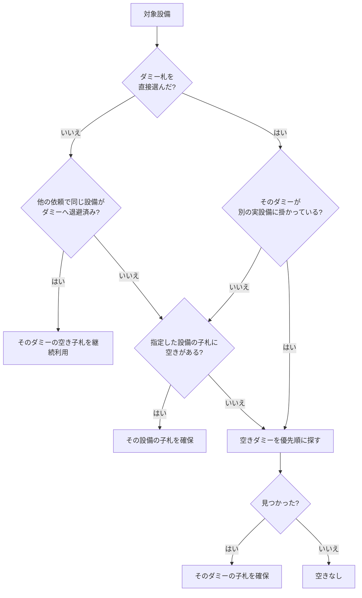

# 子札割当ロジック

開発者・保守担当者向けに、停電依頼を発行したときに「どの禁止札（親札）のどの子札を確保するか」を決めるルールをまとめます。実装は [`server/requestAssignmentService.js`](../server/requestAssignmentService.js) に集約し、API ルート（`server.js`）は入出力と永続化だけを担当します。

## 用語とデータ

| 用語 | 意味 | 保存先 |
| --- | --- | --- |
| 設備（MCCB） | 遮断器 1 台。禁止札 1 枚に相当します。 | `mccbs` |
| 子札 | 設備 1 台に複数枚ぶら下がる作業者用の札（現行データは 5 枚）。 | `child_cards` |
| ダミー札 | 禁止札を用意していない設備の代わりに掛ける予備札。`is_dummy`、名称に「ダミー」、ID に `DUMMY` のいずれかで判定します。 | `mccbs` |
| 依頼（発行中） | 確保済みの子札を持つ停電作業依頼。 | `app_collections.requests` |
| 仮発行依頼 | 入力内容だけを保存し、子札を確保していない依頼。 | `app_collections.draftRequests` |

依頼が持つ割当結果は次の 3 つです。

| フィールド | 内容 |
| --- | --- |
| `targetMccbIds` | 利用者が選択した対象設備 ID の配列。 |
| `dummyNames[対象ID]` | ダミー札を選んだときに入力する「実際に作業する設備名称」。割当結果には `customDummyName` として複写されます。 |
| `reservedCards[対象ID]` | 確保結果。`actualMccbId`（実際に札を出した設備）、`cardNo`（子札番号）、`displayName`、`customDummyName`。確保できなかった場合は `actualMccbId: null`、`displayName: "空きなし"`。 |
| `returnedCards[対象ID]` | 一部返却した対象の記録。返却時に `reservedCards` から移されます。 |

## 割当が走る操作

| 操作 | API | 割当の扱い |
| --- | --- | --- |
| 依頼作成画面のプレビュー | `POST /api/requests/preview` | 割当をシミュレーションするだけで DB は変更しません。 |
| 停電依頼の発行 | `POST /api/requests` | ここで初めて子札を確保します。 |
| 仮発行 | `POST /api/draft-requests` | **割当しません。** 入力内容だけ保存します。 |
| 仮発行の本発行 | `POST /api/draft-requests/:id/issue` | 本発行時点の空き状況で割当をやり直します。 |
| 発行中依頼への設備追加 | `PATCH /api/requests/:id/targets` | 既存予約は維持し、追加分だけ割当します。 |

## 割当の基本手順

`buildRequestAssignment(newRequest)` は次の順で処理します。

1. **探索範囲を読む** — 対象設備（`readMccbsByIds`）と全ダミー札（`readDummyMccbs`）だけを読み込みます。無関係な設備は見ません。
2. **発行中依頼の予約を反映する** — 発行中依頼の `reservedCards` から `actualMccbId` と `cardNo` を集め、作業用コピー上でその子札を貸出中に上書きします。DB の `is_borrowed` が空きに見えても、予約が残っていれば貸出中として扱います（一時返却中の札を他依頼に取られないため）。
3. **対象設備を順番に確保する** — `targetMccbIds` の順に後述の判定を行い、確保できた札は作業用コピーへ即反映します。これにより同じ依頼の中で同じ子札を二重に取ることはありません。
4. **変更ぶんだけ保存する** — 子札が変化した設備だけを抽出し（`getChangedMccbs`）、停送電状態は上書きしません（`preservePowerStateForRequestChanges`）。

## 1 設備ぶんの判定



### 退避先ダミーの優先順

候補になるのは**子札を 1 枚も貸し出していないダミー札**だけです（1 台のダミーを複数の実設備に掛けないため）。その中から次の順で選びます。

1. 対象設備と同じ電気室のダミー — 名称の数値順（ダミー0、ダミー1、…）
2. 他の電気室のダミー — ダミー0 を先頭に、以降は名称の数値順

## ダミー札のルール

ダミー札の親札は物理的に 1 台の設備にしか掛けられないため、**1 枚のダミー札は 1 つの実設備だけを表す**ことを不変条件にしています。

実設備の同定は予約情報の `customDummyName || 対象ID` で行います。

| 予約の種類 | 実設備の表し方 |
| --- | --- |
| ダミーを直接選択（代替名を入力） | `customDummyName`（入力された設備名称）。指定ダミーが埋まって別ダミーへ振り替えられた場合も同じです。 |
| 通常設備の札が足りずダミーへ退避 | 対象ID（元設備の ID）。 |

このため次のように振る舞います。

- 同じ実設備を指す依頼どうしは、同じダミー札の別の子札を使えます（相乗り）。
- 別の実設備が掛かっているダミー札は、空き子札が残っていても使いません。次の空きダミーへ回します。
- 同じ依頼の中で先に退避割当したダミーも、まだ保存前の予約（`pendingReservedCards`）を見て同じ判定を行います。

## 仮発行の扱い

仮発行は札を確保しません。`reservedCards` を持たないため、**仮発行中のダミー札は他の依頼から空きに見えます**。

- 割当が確定するのは本発行の瞬間だけで、結果は**本発行した順序**で決まります。
- 仮発行時のプレビューはその時点のシミュレーションなので、本発行結果と一致しないことがあります。
- 同じダミー札を指定した仮発行が複数あると、2 件目以降は本発行時に次の空きダミーへ振り替えられます。

## 札を手放す操作

| 操作 | API | 子札 | 予約 |
| --- | --- | --- | --- |
| 一時返却・再貸出 | `PATCH /api/requests/:id/targets/:targetId/card` | 予約している 1 枚だけ切り替え | **残す**（他依頼に取られない） |
| 一部返却 | `PATCH /api/requests/:id/targets/return` | 解放 | `reservedCards` から `returnedCards` へ移動。再度追加すれば確保し直せます。 |
| 解約・作業完了 | `DELETE /api/requests/:id` | すべて解放 | 依頼を履歴へ移動 |

子札の解放は、その札の `workerName` が依頼の作業者と一致する場合だけ行います（別作業者が借りている札は触りません）。

## 表示名のルール

割当結果の表示は、元設備・振替先・代替名の 3 つを組み合わせて決めます。共通判定は [`resolveRequestSourceName`](../src/shared/mccbViewUtils.js) に置き、プレビュー・依頼一覧・レシート印刷で同じ結果になるようにしています。

| 状況 | 表示 |
| --- | --- |
| 通常設備を自分の札で確保 | `設備名` |
| 通常設備をダミーへ退避 | `ダミー名 (設備名)` |
| ダミーを直接選択 | `ダミー名 (代替名)` |
| ダミーを直接選択して別ダミーへ振替 | `振替先ダミー名 (代替名)` |
| 確保できなかった | `空きなし` |

依頼作成画面では、発行中依頼が掛けているダミー札に `🏷️ 〇〇 で発行中` を表示します（`createActiveDummyUsageMap`）。代替名を入力した依頼のダミーを選んだ場合はその代替名を自動で引き継ぐため、同じ親札の空き子札が確保されます。代替名を書き換えると別の実設備として扱われ、次の空きダミーへ回ります。

## 注意点

- 確保できなかった対象はエラーではなく `空きなし` として依頼に残ります。発行前にプレビューで確認してください。
- 仮発行は札を押さえないため、発行順によって割当先が変わります。当日分をまとめて仮発行する運用は [修繕日・大修繕日 仮発行手順書](maintenance-batch-request-user-manual.md) を参照してください。
- ダミー札の直接選択では代替名が実設備の同定キーになります。同じ設備を指すなら表記を揃えてください（画面の自動引き継ぎを使えば一致します）。

## 自己チェック

```bash
node server/requestAssignmentService.test.mjs
node src/shared/mccbViewUtils.test.mjs
```

割当ルールと表示名の集計を `assert` で検証します。ロジックを変更したら実行してください。
