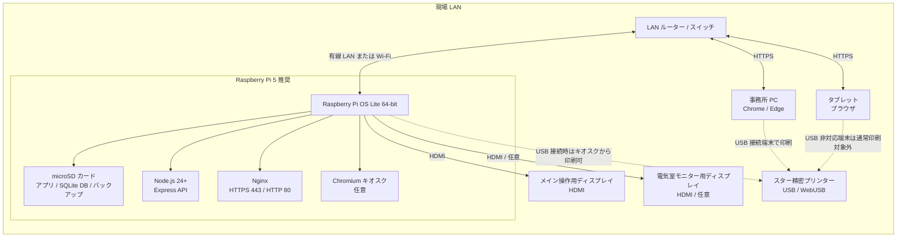
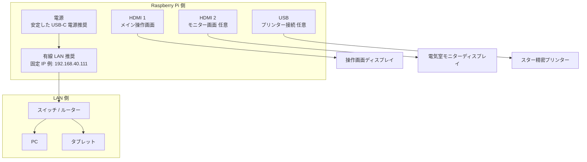
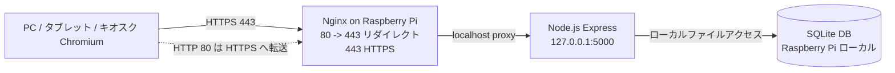
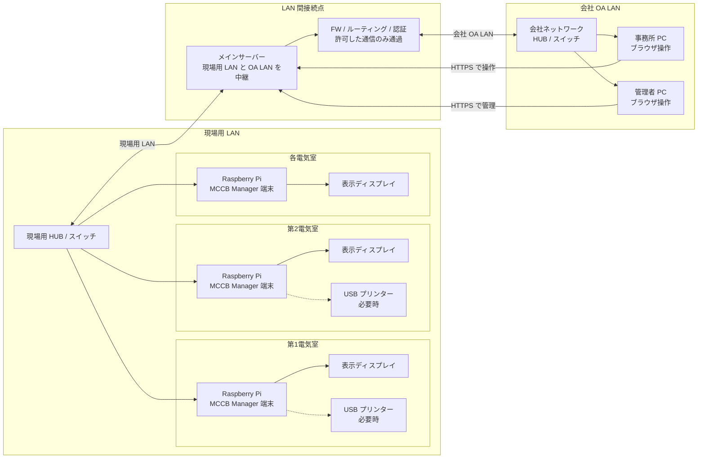

# ハードウェア構成図

MCCB Manager の標準構成は、Raspberry Pi をアプリサーバー兼キオスク端末として使い、LAN 内の PC・タブレットから同じ Web 画面にアクセスする構成です。印刷が必要な端末にはスター精密プリンターを USB 接続し、ブラウザの WebUSB から直接印刷します。

## 標準構成

## 接続パターン

## 役割別の機器一覧

| 区分 | 機器 | 役割 | 備考 |
| --- | --- | --- | --- |
| サーバー | Raspberry Pi 5 推奨 | Web アプリ、API、SQLite DB、バックアップを常時稼働 | Node.js 24 以上を使用 |
| ストレージ | microSD カード | OS、アプリ、`data/mccb_data.sqlite`、`data/backups/` を保存 | 定期的な DB バックアップ取得を推奨 |
| ネットワーク | LAN ルーター / スイッチ | Pi、PC、タブレットを同一 LAN に接続 | 運用時は固定 IP が分かりやすい |
| 表示 | HDMI ディスプレイ | Pi 本体のキオスク表示 | メイン操作画面とモニター画面の 2 画面構成も可能 |
| 操作端末 | PC / タブレット | `https://<Raspberry Pi の IP>/#/` を開いて操作 | WebUSB 印刷は Chrome/Edge かつ HTTPS または localhost が必要 |
| 印刷 | スター精密プリンター | 停電依頼表などを印刷 | USB 接続した端末のブラウザから WebUSB で印刷 |

## 通信とポート

- LAN 端末からは `https://<Raspberry Pi の IP>/#/` にアクセスします。
- Nginx は 80 番を 443 番へリダイレクトし、443 番で Express にリバースプロキシします。
- Express は Raspberry Pi 内部の `127.0.0.1:5000` で動作します。
- SQLite DB とバックアップは Raspberry Pi のローカルストレージに保存されます。

## 将来構成案: 現場用 LAN と会社 OA LAN の接続

今後、会社 OA LAN からも事務所パソコンで MCCB Manager を操作できるようにする場合は、現場用 LAN と OA LAN をメインサーバーで中継し、各電気室の Raspberry Pi を現場用 LAN 側の HUB に接続する構成を想定します。

### 将来構成の考え方

- 現場側は、各電気室に Raspberry Pi を配置し、現場用 HUB / スイッチで現場用 LAN に収容します。
- OA LAN 側は、会社ネットワークに接続された事務所 PC からブラウザで操作します。
- 現場用 LAN と OA LAN は直接混在させず、メインサーバーを境界として接続します。
- メインサーバーでは、ルーティング、ファイアウォール、HTTPS 終端、認証、ログ取得などを集約する想定です。
- OA LAN から現場側へ許可する通信は、MCCB Manager の Web 操作用 HTTPS など必要最小限にします。
- 各 Raspberry Pi を独立運用する場合は、メインサーバーから各 Pi へリバースプロキシする方式、またはメインサーバーへデータを集約する方式を選定します。

### 将来構成で検討が必要な項目

| 項目 | 検討内容 |
| --- | --- |
| IP アドレス設計 | 現場用 LAN と OA LAN のセグメント、固定 IP、名前解決方法 |
| 通信制御 | OA LAN から現場用 LAN へ許可する宛先、ポート、プロトコル |
| 認証 | 事務所 PC からの操作権限、管理者権限、パスワード運用 |
| HTTPS 証明書 | OA LAN 端末で警告なく使える証明書配布または社内 CA 利用 |
| データ集約 | 各電気室 Pi の DB を独立管理するか、メインサーバーに集約するか |
| 障害時運用 | メインサーバー停止時に現場側 Pi 単体で操作継続できるか |
| 印刷 | 依頼表を事務所 PC 側で印刷するか、各電気室の USB プリンターで印刷するか |

## WebUSB 印刷時の注意

- プリンターは、印刷操作を行う端末に USB 接続します。
- WebUSB を使う端末は Chrome/Edge を利用し、`localhost` または HTTPS の安全なコンテキストでアプリを開きます。
- タブレットなど USB 接続できない端末では、操作は可能でも WebUSB 印刷はできない場合があります。
