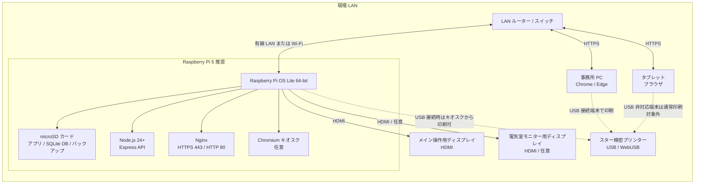
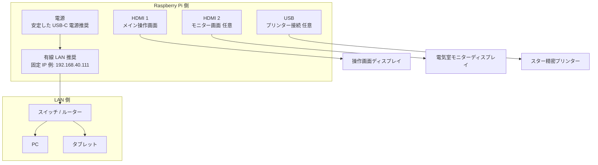
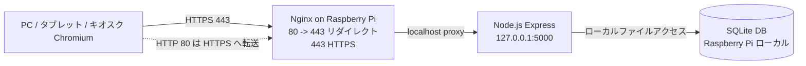
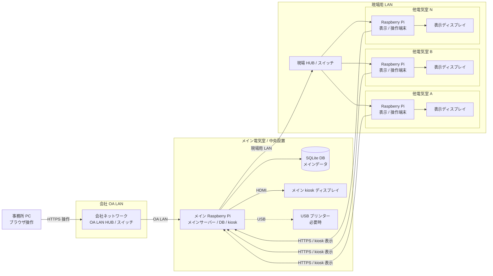

# ハードウェア構成図

MCCB Manager の標準構成は、Raspberry Pi をアプリサーバー兼キオスク端末として使い、LAN 内の PC・タブレットから同じ Web 画面にアクセスする構成です。印刷が必要な端末にはスター精密プリンターを USB 接続し、ブラウザの WebUSB から直接印刷します。

## 標準構成



## 接続パターン



## 役割別の機器一覧

| 区分 | 機器 | 役割 | 備考 |
| --- | --- | --- | --- |
| サーバー | Raspberry Pi 5 推奨 | Web アプリ、API、SQLite DB、バックアップを常時稼働 | Node.js 24 以上を使用 |
| ストレージ | microSD カード | OS、アプリ、`data/mccb_data.sqlite`、`data/backups/` を保存 | 定期的な DB バックアップ取得を推奨 |
| ネットワーク | LAN ルーター / スイッチ | Pi、PC、タブレットを同一 LAN に接続 | 運用時は固定 IP が分かりやすい |
| 表示 | HDMI ディスプレイ | Pi 本体のキオスク表示 | メイン操作画面とモニター画面の 2 画面構成も可能 |
| 操作端末 | PC / タブレット | `https://<Raspberry Pi の IP>/#/` を開いて操作 | WebUSB 印刷は Chrome/Edge かつ HTTPS または localhost が必要 |
| 印刷 | スター精密プリンター | 停電依頼表などを印刷 | USB 接続した端末のブラウザから WebUSB で印刷 |

## 通信とポート



- LAN 端末からは `https://<Raspberry Pi の IP>/#/` にアクセスします。
- Nginx は 80 番を 443 番へリダイレクトし、443 番で Express にリバースプロキシします。
- Express は Raspberry Pi 内部の `127.0.0.1:5000` で動作します。
- SQLite DB とバックアップは Raspberry Pi のローカルストレージに保存されます。

## 将来構成案: OA LAN 接続 + メイン Raspberry Pi 中継

今後、会社 OA LAN から事務所 PC で操作する構成では、メインの Raspberry Pi を「メインサーバー・DB・kiosk・LAN 間中継点」として配置します。接続の流れは `事務所 PC → OA LAN → メイン Raspberry Pi → 現場 HUB → 他電気室 Raspberry Pi` を想定します。



### 将来構成の接続順

```text
事務所 PC
  ↓
会社 OA LAN
  ↓
メイン Raspberry Pi（メインサーバー・DB・kiosk）
  ↓
現場 HUB
  ↓
他電気室 Raspberry Pi
```

### 将来構成の考え方

- メイン Raspberry Pi は、OA LAN 側からの入口、アプリ本体、SQLite DB、kiosk 表示を兼ねます。
- 事務所 PC は会社 OA LAN に接続し、ブラウザでメイン Raspberry Pi の MCCB Manager に HTTPS 接続して操作します。
- 現場側は、メイン Raspberry Pi から現場 HUB に接続し、HUB 配下に他電気室の Raspberry Pi を収容します。
- 他電気室 Raspberry Pi は、メイン Raspberry Pi の画面を kiosk 表示する端末として使う想定です。
- DB をメイン Raspberry Pi に集約することで、事務所 PC と各電気室端末が同じデータを参照できます。
- OA LAN と現場用 LAN を接続するため、メイン Raspberry Pi では通信制御、HTTPS、認証、ログ管理を特に重視します。

### 将来構成で検討が必要な項目

| 項目 | 検討内容 |
| --- | --- |
| メイン Raspberry Pi の配置 | OA LAN と現場 HUB の両方へ接続できる場所、電源、UPS、保守性 |
| ネットワーク分離 | OA LAN 側と現場用 LAN 側を同一セグメントにするか、別セグメントにしてルーティングするか |
| IP アドレス設計 | OA LAN 側 IP、現場用 LAN 側 IP、他電気室 Raspberry Pi の固定 IP |
| 通信制御 | 事務所 PC からメイン Raspberry Pi への HTTPS、他電気室 Pi からメイン Raspberry Pi への HTTPS |
| 認証 | 事務所 PC からの操作権限、管理者権限、パスワード運用 |
| HTTPS 証明書 | OA LAN 端末と他電気室 Pi で警告なく使える証明書配布または社内 CA 利用 |
| DB / バックアップ | メイン Raspberry Pi の SQLite DB バックアップ、microSD 障害対策、復旧手順 |
| 障害時運用 | メイン Raspberry Pi 停止時に全端末が操作不可になるため、予備機または復旧手順を用意 |
| 印刷 | メイン Raspberry Pi 接続プリンターで印刷するか、事務所 PC 側で印刷するか |

## WebUSB 印刷時の注意

- プリンターは、印刷操作を行う端末に USB 接続します。
- WebUSB を使う端末は Chrome/Edge を利用し、`localhost` または HTTPS の安全なコンテキストでアプリを開きます。
- タブレットなど USB 接続できない端末では、操作は可能でも WebUSB 印刷はできない場合があります。
