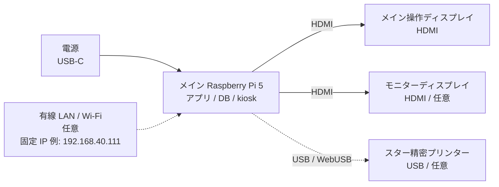
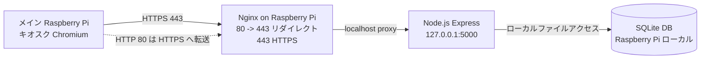
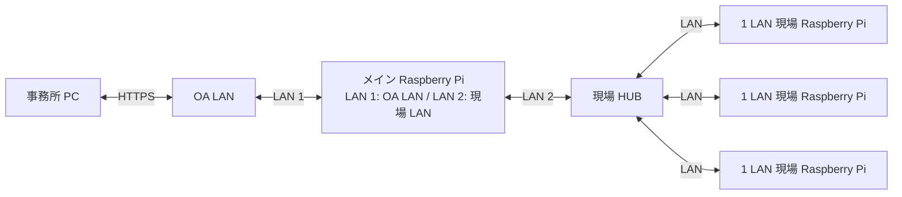

# ハードウェア構成図

MCCB Manager の標準構成は、メイン Raspberry Pi 1 台をアプリサーバー兼キオスク端末として使う構成です。メイン Raspberry Pi にディスプレイと必要なプリンターを接続し、同じ本体上で Web アプリの表示と操作を行います。

## 標準構成

- 電源は安定した USB-C 電源を使用します。
- 有線 LAN / Wi-Fi は保守、更新、拡張端末接続が必要な場合に接続します。
- プリンターは必要な場合だけメイン Raspberry Pi に USB 接続します。

## 役割別の機器一覧

| 区分 | 機器 | 役割 | 備考 |
| --- | --- | --- | --- |
| サーバー / 操作端末 | メイン Raspberry Pi 5 推奨 | Web アプリ、API、SQLite DB、バックアップ、kiosk 表示を 1 台で常時稼働 | Node.js 24 以上を使用 |
| ストレージ | microSD カード | OS、アプリ、`data/mccb_data.sqlite`、`data/backups/` を保存 | 定期的な DB バックアップ取得を推奨 |
| ネットワーク | 有線 LAN / Wi-Fi | メイン Raspberry Pi の保守、更新、拡張端末接続に使用 | 1 台運用だけなら常時接続は必須ではない |
| 表示 | HDMI ディスプレイ | Pi 本体のキオスク表示 | メイン操作画面とモニター画面の 2 画面構成も可能 |
| 操作端末 | メイン Raspberry Pi の Chromium kiosk | `https://localhost/#/` または `https://<Raspberry Pi の IP>/#/` を開いて操作 | 標準構成では Pi 本体で操作 |
| 印刷 | スター精密プリンター | 停電依頼表などを印刷 | メイン Raspberry Pi に USB 接続し、kiosk から WebUSB で印刷 |

## 通信とポート

- 標準構成では、メイン Raspberry Pi の kiosk から `https://localhost/#/` または `https://<Raspberry Pi の IP>/#/` にアクセスします。
- Nginx は 80 番を 443 番へリダイレクトし、443 番で Express にリバースプロキシします。
- Express は Raspberry Pi 内部の `127.0.0.1:5000` で動作します。
- SQLite DB とバックアップは Raspberry Pi のローカルストレージに保存されます。

## OA LAN 接続構成: 2 LAN メイン Raspberry Pi 中継

会社 OA LAN から事務所 PC で操作し、現場側の Raspberry Pi へ展開する構成です。メイン Raspberry Pi は LAN ポートを 2 系統持たせ、OA LAN 側と現場 LAN 側の接続点にします。

### 機器ごとの役割

| 機器 | LAN 接続 | 役割 |
| --- | --- | --- |
| 事務所 PC | OA LAN に接続 | ブラウザで MCCB Manager を操作 |
| OA LAN | 事務所 PC とメイン Raspberry Pi の LAN 1 を接続 | 事務所側ネットワーク |
| メイン Raspberry Pi | LAN 1: OA LAN、LAN 2: 現場 HUB | Web アプリ、SQLite DB、kiosk、OA LAN と現場 LAN の接続点 |
| HUB | メイン Raspberry Pi の LAN 2 と現場 Raspberry Pi を接続 | 現場側端末の集約 |
| 現場 Raspberry Pi | 現場 HUB に接続 | メイン Raspberry Pi の画面を kiosk 表示、または現場操作端末として利用 |

### 構成の考え方

- メイン Raspberry Pi は、OA LAN 側からの入口、アプリ本体、SQLite DB、kiosk 表示、現場 LAN 側への接続点を兼ねます。
- メイン Raspberry Pi の LAN 1 を OA LAN 側、LAN 2 を現場 HUB 側に分けます。
- 事務所 PC は会社 OA LAN に接続し、ブラウザでメイン Raspberry Pi の MCCB Manager に HTTPS 接続して操作します。
- 現場側は、メイン Raspberry Pi の現場 LAN 側ポートから現場 HUB に接続し、HUB 配下に 1 LAN の Raspberry Pi を収容します。
- 現場 Raspberry Pi は、メイン Raspberry Pi の画面を kiosk 表示する端末として使う想定です。
- DB をメイン Raspberry Pi に集約することで、事務所 PC と各電気室端末が同じデータを参照できます。
- OA LAN と現場 LAN の境界にメイン Raspberry Pi を置くため、通信制御、HTTPS、認証、ログ管理を特に重視します。

### 構成で検討が必要な項目

| 項目 | 検討内容 |
| --- | --- |
| メイン Raspberry Pi の配置 | OA LAN と現場 HUB の両方へ接続できる場所、電源、UPS、保守性 |
| LAN ポート | メイン Raspberry Pi は 2 LAN 構成にする。内蔵 LAN + USB LAN アダプターなどを想定 |
| ネットワーク分離 | OA LAN 側と現場用 LAN 側を同一セグメントにするか、別セグメントにしてルーティングするか |
| IP アドレス設計 | メイン Raspberry Pi の OA LAN 側 IP、現場 LAN 側 IP、現場 Raspberry Pi の固定 IP |
| 通信制御 | 事務所 PC からメイン Raspberry Pi への HTTPS、現場 Raspberry Pi からメイン Raspberry Pi への HTTPS |
| 認証 | 事務所 PC からの操作権限、管理者権限、パスワード運用 |
| HTTPS 証明書 | OA LAN 端末と現場 Raspberry Pi で警告なく使える証明書配布または社内 CA 利用 |
| DB / バックアップ | メイン Raspberry Pi の SQLite DB バックアップ、microSD 障害対策、復旧手順 |
| 障害時運用 | メイン Raspberry Pi 停止時に全端末が操作不可になるため、予備機または復旧手順を用意 |
| 印刷 | メイン Raspberry Pi 接続プリンターで印刷するか、事務所 PC 側で印刷するか |

## WebUSB 印刷時の注意

- プリンターは、印刷操作を行う端末に USB 接続します。
- WebUSB を使う端末は Chrome/Edge を利用し、`localhost` または HTTPS の安全なコンテキストでアプリを開きます。
- タブレットなど USB 接続できない端末では、操作は可能でも WebUSB 印刷はできない場合があります。
