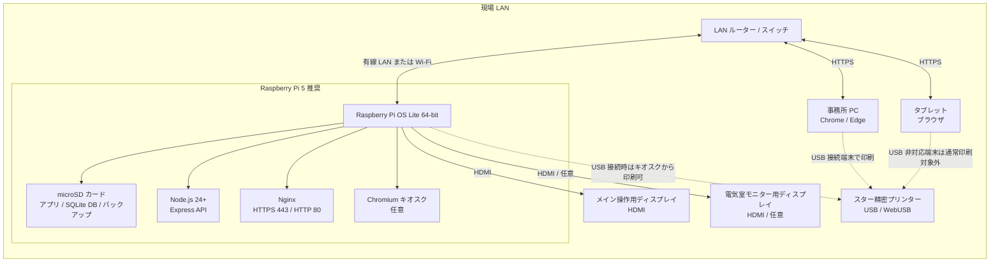
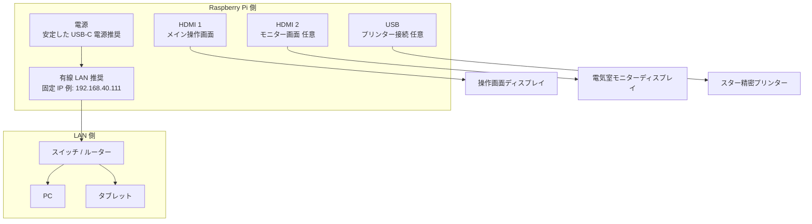
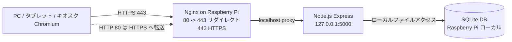

# ハードウェア構成図

MCCB Manager の標準構成は、Raspberry Pi をアプリサーバー兼キオスク端末として使い、LAN 内の PC・タブレットから同じ Web 画面にアクセスする構成です。印刷が必要な端末にはスター精密プリンターを USB 接続し、ブラウザの WebUSB から直接印刷します。

## 標準構成

## 接続パターン

## 役割別の機器一覧

| 区分 | 機器 | 役割 | 備考 |
| --- | --- | --- | --- |
| サーバー | Raspberry Pi 5 推奨 | Web アプリ、API、SQLite DB、バックアップを常時稼働 | Node.js 24 以上を使用 |
| ストレージ | microSD カード | OS、アプリ、`data/mccb_data.sqlite`、`data/backups/` を保存 | 定期的な DB バックアップ取得を推奨 |
| ネットワーク | LAN ルーター / スイッチ | Pi、PC、タブレットを同一 LAN に接続 | 運用時は固定 IP が分かりやすい |
| 表示 | HDMI ディスプレイ | Pi 本体のキオスク表示 | メイン操作画面とモニター画面の 2 画面構成も可能 |
| 操作端末 | PC / タブレット | `https://<Raspberry Pi の IP>/#/` を開いて操作 | WebUSB 印刷は Chrome/Edge かつ HTTPS または localhost が必要 |
| 印刷 | スター精密プリンター | 停電依頼表などを印刷 | USB 接続した端末のブラウザから WebUSB で印刷 |

## 通信とポート

- LAN 端末からは `https://<Raspberry Pi の IP>/#/` にアクセスします。
- Nginx は 80 番を 443 番へリダイレクトし、443 番で Express にリバースプロキシします。
- Express は Raspberry Pi 内部の `127.0.0.1:5000` で動作します。
- SQLite DB とバックアップは Raspberry Pi のローカルストレージに保存されます。

## WebUSB 印刷時の注意

- プリンターは、印刷操作を行う端末に USB 接続します。
- WebUSB を使う端末は Chrome/Edge を利用し、`localhost` または HTTPS の安全なコンテキストでアプリを開きます。
- タブレットなど USB 接続できない端末では、操作は可能でも WebUSB 印刷はできない場合があります。
