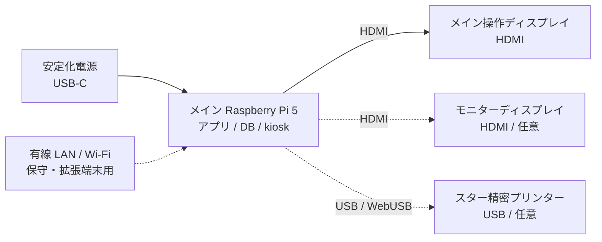
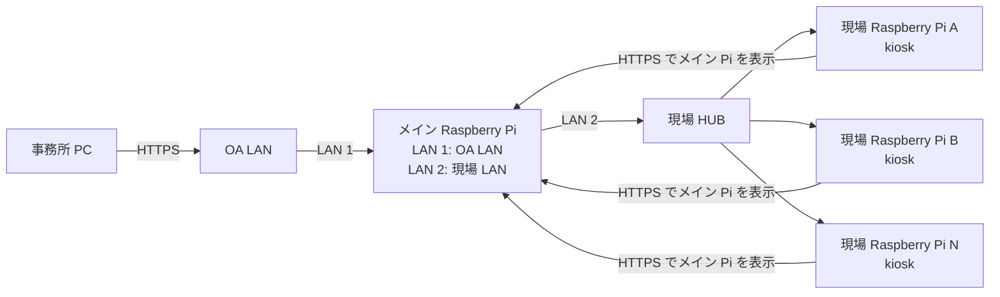

# ハードウェア構成

MCCB Manager の標準構成は、メイン Raspberry Pi 1 台をアプリサーバー、DB、kiosk 端末として使う構成です。この文書では、機器の役割と物理的な接続をまとめます。

アプリ、API、DB の内部構成は [システム構成](system-architecture.md)、OA LAN と現場 LAN の具体的な設定は [Raspberry Pi OA LAN 接続設定案](raspberry-pi-oalan-settings.md) を参照してください。

## 標準構成



## 機器一覧

| 区分 | 機器 | 役割 | 備考 |
| --- | --- | --- | --- |
| サーバー / 操作端末 | メイン Raspberry Pi 5 推奨 | Web アプリ、API、SQLite DB、バックアップ、kiosk 表示を 1 台で常時稼働 | Raspberry Pi OS Lite 64-bit、Node.js 24 以上を使用 |
| ストレージ | microSD カード | OS、アプリ、`data/mccb_data.sqlite`、`data/backups/` を保存 | 定期的な DB バックアップ取得を推奨 |
| ネットワーク | 有線 LAN / Wi-Fi | 保守、更新、PC・タブレット接続 | 固定 IP 推奨 |
| 表示 | HDMI ディスプレイ | Pi 本体の kiosk 表示 | メイン操作画面とモニター画面の 2 画面構成も可能 |
| 操作端末 | PC / タブレット / Pi kiosk | `https://<Raspberry Pi の IP>/#/` を開いて操作 | WebUSB 印刷には Chrome/Edge と安全なコンテキストが必要 |
| 印刷 | スター精密プリンター | 停電依頼表などを印刷 | 印刷操作を行う端末へ USB 接続 |

## OA LAN 接続構成

会社 OA LAN から事務所 PC で操作し、現場側 Raspberry Pi でも同じ画面を kiosk 表示する拡張構成です。メイン Raspberry Pi は 2 LAN 構成にし、OA LAN 側と現場 LAN 側の接続点にします。

OA LAN と現場 LAN は切り離して運用します。メイン Raspberry Pi は両方の LAN に接続しますが、OA LAN と現場 LAN の間でパケットを転送するルーターやブリッジにはしません。



### 機器ごとの役割

| 機器 | LAN 接続 | 役割 |
| --- | --- | --- |
| 事務所 PC | OA LAN に接続 | ブラウザで MCCB Manager を操作 |
| メイン Raspberry Pi | LAN 1: OA LAN、LAN 2: 現場 HUB | Web アプリ、SQLite DB、kiosk、両 LAN からの HTTPS 入口 |
| 現場 HUB | メイン Raspberry Pi の LAN 2 と現場 Raspberry Pi を接続 | 現場側端末の集約 |
| 現場 Raspberry Pi | 現場 HUB に接続 | メイン Raspberry Pi の画面を kiosk 表示（サーバーは構築しない、`-KioskOnly` デプロイ） |

### IP アドレス例

```text
OA LAN:        192.168.10.0/24
Main Pi LAN1:  192.168.10.50

現場 LAN:      192.168.40.0/24
Main Pi LAN2:  192.168.40.111
現場 Pi:       192.168.40.121, 192.168.40.122 ...
```

この場合、事務所 PC は `https://192.168.10.50/#/`、現場 Raspberry Pi は `https://192.168.40.111/#/` を開きます。具体的な固定 IP、ファイアウォール、証明書設定は [Raspberry Pi OA LAN 接続設定案](raspberry-pi-oalan-settings.md) にまとめています。

## 構成検討チェックリスト

| 項目 | 確認内容 |
| --- | --- |
| メイン Raspberry Pi の配置 | OA LAN と現場 HUB の両方へ接続できる場所、電源、UPS、保守性 |
| LAN ポート | 2 LAN 構成にする場合は、内蔵 LAN + USB LAN アダプターなどを用意 |
| IP アドレス設計 | メイン Raspberry Pi の OA LAN 側 IP、現場 LAN 側 IP、現場 Raspberry Pi の固定 IP |
| 通信制御 | 事務所 PC・現場 Pi からメイン Pi への HTTPS、保守用 SSH の接続元制限 |
| 認証 | 事務所 PC からの操作権限、管理者権限、パスワード運用 |
| HTTPS 証明書 | OA LAN 端末と現場 Raspberry Pi で警告なく使える証明書配布または社内 CA 利用 |
| DB / バックアップ | SQLite DB バックアップ、microSD 障害対策、復旧手順 |
| 障害時運用 | メイン Raspberry Pi 停止時に全端末が操作不可になるため、予備機または復旧手順を用意 |
| 印刷 | メイン Raspberry Pi 接続プリンターで印刷するか、事務所 PC 側で印刷するか |

## WebUSB 印刷時の注意

- プリンターは、印刷操作を行う端末に USB 接続します。
- WebUSB を使う端末は Chrome/Edge を利用し、`localhost` または HTTPS の安全なコンテキストでアプリを開きます。
- タブレットなど USB 接続できない端末では、操作は可能でも WebUSB 印刷はできない場合があります。
