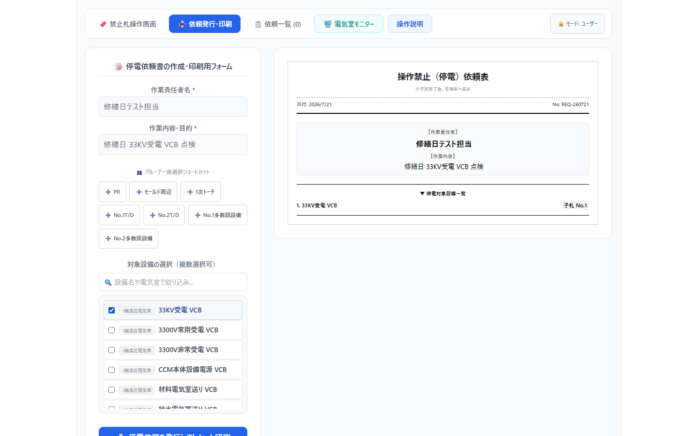
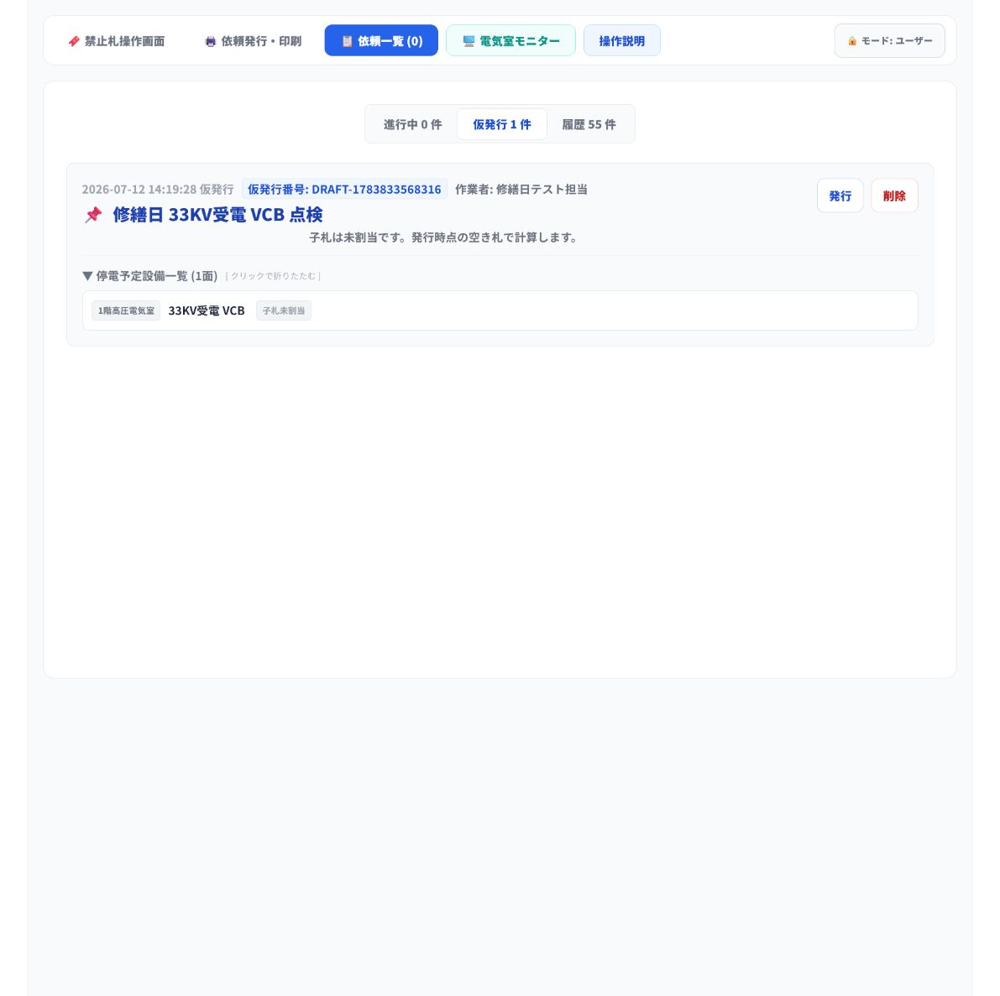

# 修繕日・大修繕日 仮発行手順書

> この手順書は、修繕日・大修繕日に予定されている停電作業について、依頼を事前に「仮発行」として登録しておき、当日に内容が一致した依頼だけを正式に発行する手順です。

## 1. 手順の全体像

1. 通常の停電依頼と同じように、作業責任者名・作業内容・対象設備を入力します。
2. 依頼ごとに **仮発行として保存** します。
3. 修繕日または大修繕日に、作業者から依頼を受けます。
4. **依頼一覧** の **仮発行** タブから、作業名・作業者が一致する依頼を探します。
5. 対象設備を確認し、該当する依頼だけを **発行** します。
6. 発行後は、通常の停電手順に従って禁止札の持ち出し、現地停電、操作画面での停電中切替を行います。

## 2. 修繕日前に通常依頼と同じ内容を入力する

1. 上部メニューの **依頼発行・印刷** を選択します。
2. **作業責任者名** に作業者または作業責任者の氏名を入力します。
3. **作業内容・目的** に、修繕日または大修繕日の作業内容を具体的に入力します。
4. **対象設備の選択（複数選択可）** から、停電する設備をすべて選択します。
5. 右側の依頼表プレビューで、作業責任者名、作業内容、対象設備が正しいことを確認します。

**入力例**

| 項目 | 入力例 |
| --- | --- |
| 作業責任者名 | 修繕日テスト担当 |
| 作業内容・目的 | 修繕日 33KV受電 VCB 点検 |
| 対象設備 | 1階高圧電気室 33KV受電 VCB |

## 3. 仮発行として保存する

1. 依頼表プレビューの内容を確認します。
2. 左下の **仮発行として保存** を押します。
3. 「停電依頼を仮発行し、仮発行一覧へ登録しました。」と表示されたことを確認します。
4. 修繕日にまとめて扱う依頼が複数ある場合は、依頼ごとに同じ操作を繰り返します。

**注意**

- 仮発行の段階では、子札はまだ割り当てられません。子札は、当日「**発行**」を押したときに、その時点で空いている札から割り当てられます。
- 仮発行しただけでは、設備は停電中になりません。

## 4. 修繕日に仮発行一覧から該当依頼を探す

1. 作業者から停電依頼を受けます。
2. 上部メニューの **依頼一覧** を選択します。
3. **仮発行** タブを選択します。
4. 依頼表と照合し、**作業者**、**作業内容**、**予定設備** が一致する依頼を探します。
5. **停電予定設備一覧** を展開し、対象設備を確認します。

**確認ポイント**

- 似た作業名がある場合は、作業者名と設備名も必ず照合します。
- 一致しない依頼は発行しません。作業者または責任者へ確認してください。

## 5. 一致する依頼を発行する

1. 作業者、作業内容、予定設備が一致した依頼の **発行** を押します。
2. 発行後、依頼が **進行中** の一覧に移ったことを確認します。
3. 印刷された依頼表を確認します。
4. 発行時に割り当てられた子札を確認します。

**注意**

- 仮発行が複数あるときも、まとめて発行せず、依頼ごとに照合してから1件ずつ発行します。

## 6. 発行後は通常の停電手順を行う

1. 印刷された依頼表をもとに、禁止札掛けから割り当てられた子札を持ち出します。
2. 依頼表、子札、現地設備の名称を照合します。
3. 現地の安全手順に従って、実際の設備を停電します。
4. **禁止札操作画面** で設備名称を検索し、対象設備を絞り込みます。
5. 該当設備を選択し、操作画面で **現在：通常運用（送電中）** を押して **操作禁止（停電中）** に切り替えます。

通常の停電操作の詳細は、[停電依頼・停電操作 手順書](./power-outage-request-user-manual.md)を参照してください。

## 7. 作業完了前のチェックリスト

| 確認項目 | チェック |
| --- | --- |
| 作業責任者名・作業内容・対象設備を入力した | □ |
| 依頼ごとに仮発行として保存した | □ |
| 修繕日に作業者から依頼を受けた | □ |
| 仮発行一覧で作業者・作業内容・設備名を照合した | □ |
| 一致する依頼だけを発行した | □ |
| 発行後、通常の停電手順を実施した | □ |
