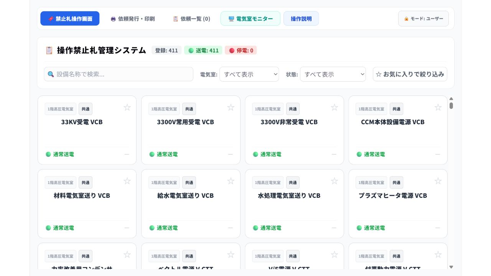
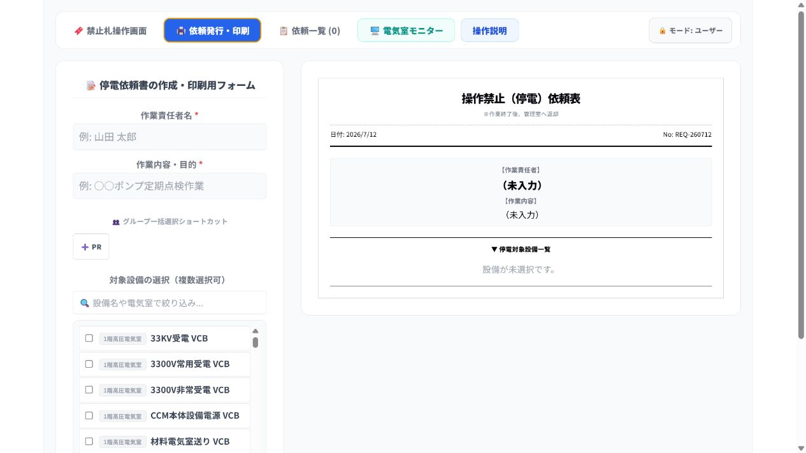
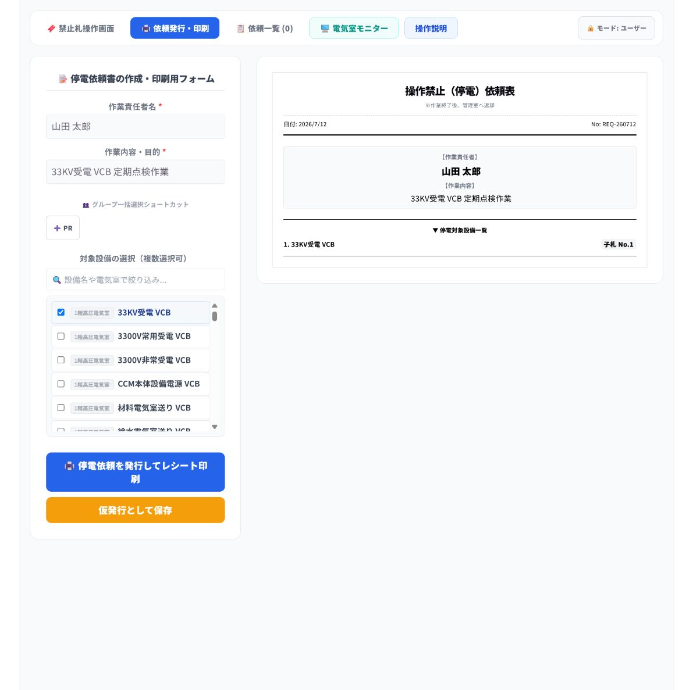
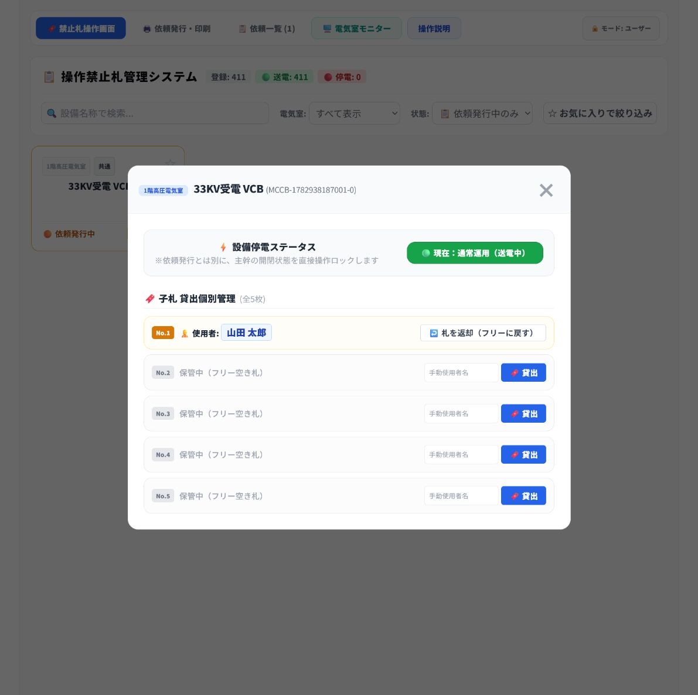
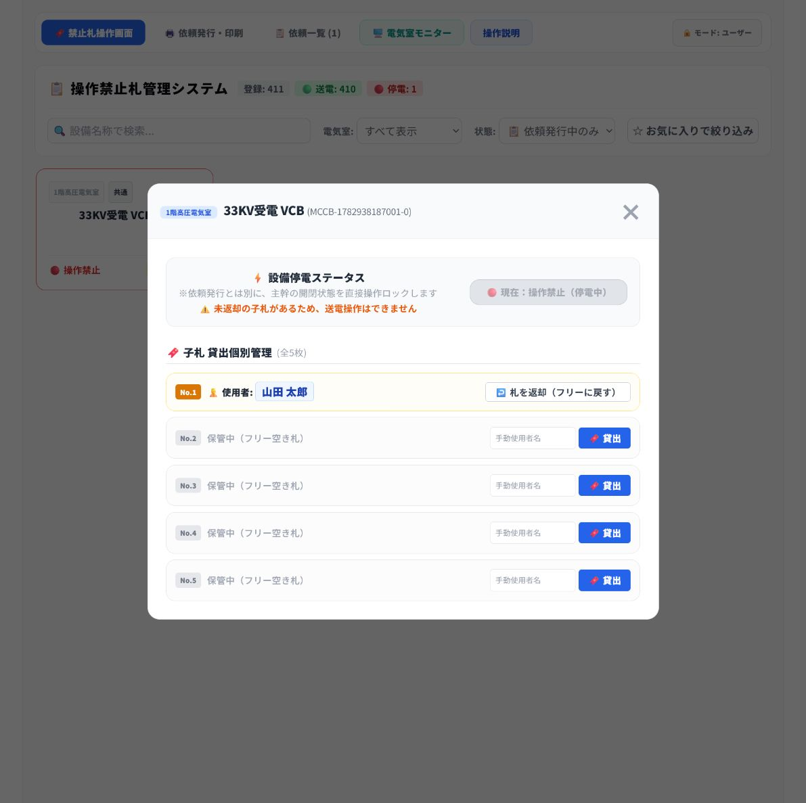

# 停電依頼・停電操作 手順書（一般作業者向け）

対象画面: `http://192.168.40.59:5000/#/`

> この手順書は、一般作業者が「停電依頼を受ける」から「依頼発行済み設備を停電状態にする」までの通常手順を、PDF化しやすい構成でまとめたものです。  
> PDFにする場合は、同じ内容を印刷向けに整えた `docs/power-outage-request-user-manual.html` をブラウザで開き、印刷先を「PDFに保存」にしてください。

## 1. 通常手順の全体像

1. 作業者より停電依頼を受けます。
2. 停電依頼作成画面で、作業者名と作業内容を入力します。
3. 停電対象の設備を選択します。
4. 依頼を発行して、依頼表を印刷します。
5. 印刷された依頼表をもとに、禁止札掛けから該当する札を持ち出します。
6. 依頼表の設備名称と現地設備の名称を確認し、設備を停電します。
7. 停電後、札操作画面で、依頼発行されている設備を「停電中」に切り替えます。

## 2. 画面を開く

1. ブラウザで `http://192.168.40.59:5000/#/` を開きます。
2. 画面上部のメニューが表示されることを確認します。
3. 停電依頼を作成する場合は、上部メニューの **依頼発行・印刷** を選択します。

**確認ポイント**

- 通常の操作は **モード: ユーザー** のままで行います。
- 停電依頼作成は、上部メニューの **依頼発行・印刷** から開始します。

## 3. 作業者名・作業内容を入力する

1. **作業責任者名** に、停電を依頼した作業者または作業責任者の氏名を入力します。
2. **作業内容・目的** に、停電が必要な作業内容を入力します。

**入力例**

| 項目 | 入力例 |
| --- | --- |
| 作業責任者名 | 山田 太郎 |
| 作業内容・目的 | 33KV受電 VCB 定期点検作業 |

**注意**

- 作業責任者名と作業内容・目的は必須項目です。
- 後で依頼表を確認したときに作業内容が分かるよう、簡潔かつ具体的に入力してください。

## 4. 停電設備を選択する

1. **対象設備の選択（複数選択可）** で、停電する設備を探します。
2. 設備数が多い場合は、検索欄に設備名または電気室名を入力して絞り込みます。
3. 停電対象設備のチェックボックスをオンにします。
4. 複数設備を停電する場合は、対象設備をすべて選択します。

**確認ポイント**

- 選択した設備は、右側の印刷プレビューに反映されます。
- ダミー札を選択した場合は、代替する実際の設備名称を入力します。
- 設備名称の選択間違いがないか、発行前に必ず確認します。

## 5. 依頼を発行して依頼表を印刷する

1. 入力内容と対象設備を確認します。
2. **停電依頼を発行してレシート印刷** または **停電依頼を発行して印刷** を押します。
3. 印刷された依頼表を受け取ります。
4. 依頼表に、作業責任者名、作業内容、停電対象設備が正しく印字されていることを確認します。

上の実画面の左下にある青い **停電依頼を発行してレシート印刷** ボタンを押します。右側の依頼表に、入力内容と選択設備が表示されていることを先に確認してください。

**注意**

- 依頼を発行しても、設備の状態は自動で停電中にはなりません。
- 実際に設備を停電した後、札操作画面で対象設備を停電中に切り替える必要があります。

## 6. 禁止札掛けから札を持ち出す

1. 印刷された依頼表を持って、禁止札掛けに移動します。
2. 依頼表に記載された設備名称を確認します。
3. 設備名称に対応する禁止札を持ち出します。
4. 持ち出す札が依頼表の設備名称と一致していることを、声出しまたは指差しで確認します。

**確認ポイント**

- 似た名称の設備がある場合は、電気室名や設備番号も確認します。
- 不明点がある場合は、依頼者または責任者に確認し、自己判断で札を持ち出さないでください。

## 7. 依頼表の名称を確認して設備を停電する

1. 現地設備の名称を確認します。
2. 依頼表に記載された設備名称と一致していることを確認します。
3. 現地の安全手順に従って、設備を停電します。
4. 停電後、必要な安全確認を行います。

**注意**

- 画面上の依頼発行は、現地設備の停電操作を代行するものではありません。
- 設備の停電操作は、現場で定められた安全手順に従って実施してください。

## 8. 札操作画面で設備を停電中にする

1. ブラウザでメイン操作画面 `http://192.168.40.59:5000/#/` を開きます。
2. 状態のプルダウンで **📋 依頼発行中のみ** を選択します。
3. 依頼発行中の設備だけが表示されたことを確認します。必要に応じて、**設備名称で検索** 欄にも設備名を入力します。
4. 依頼表の名称と一致する対象設備カードを選択します。
5. 表示された操作画面で **現在：通常運用（送電中）** ボタンを押します。
6. 表示が **現在：操作禁止（停電中）** に変わったことを確認します。

**確認ポイント**

- 停電依頼発行済みの設備だけを停電中にします。
- 設備名称をもう一度確認してから切り替えます。
- 切り替え後、設備カードの状態表示が停電中になっていることを確認します。

## 9. 作業完了前のチェックリスト

| 確認項目 | チェック |
| --- | --- |
| 依頼表の作業責任者名が正しい | □ |
| 依頼表の作業内容が正しい | □ |
| 停電対象設備をすべて選択した | □ |
| 印刷された依頼表と禁止札の名称が一致している | □ |
| 現地設備名称と依頼表の名称が一致している | □ |
| 現地で設備を停電した | □ |
| 札操作画面で対象設備を停電中に切り替えた | □ |

## 10. よくある注意事項

- **依頼を発行しただけでは、設備状態は停電中になりません。**  
  現地で停電後、必ず札操作画面で停電中へ切り替えてください。

- **設備名称の確認を省略しないでください。**  
  依頼表、禁止札、現地設備、画面上の設備名称を照合してください。

- **対象設備が見つからない場合は、検索条件を変更してください。**  
  設備名の一部、電気室名、または名称の表記ゆれを確認してください。

- **判断に迷う場合は、作業を止めて責任者に確認してください。**
