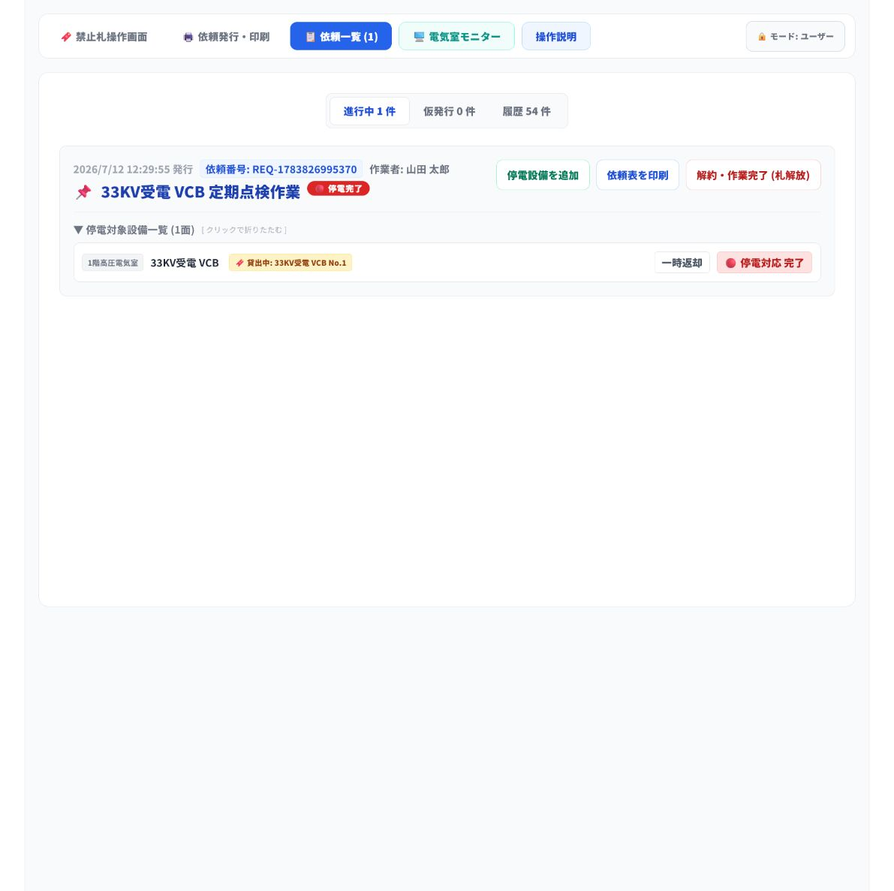
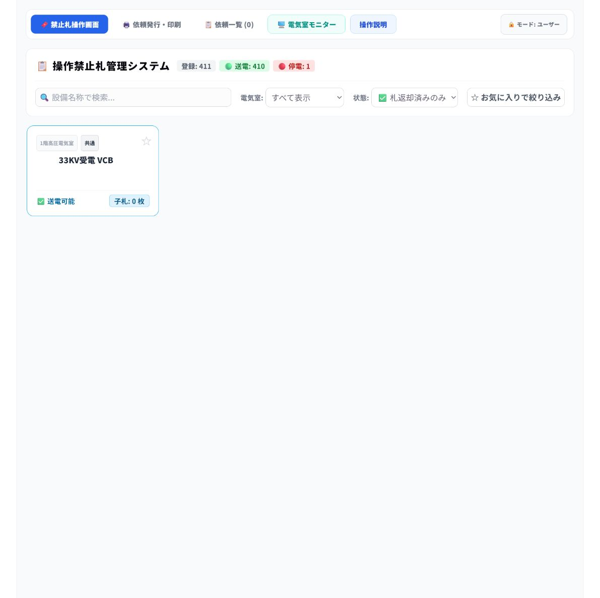
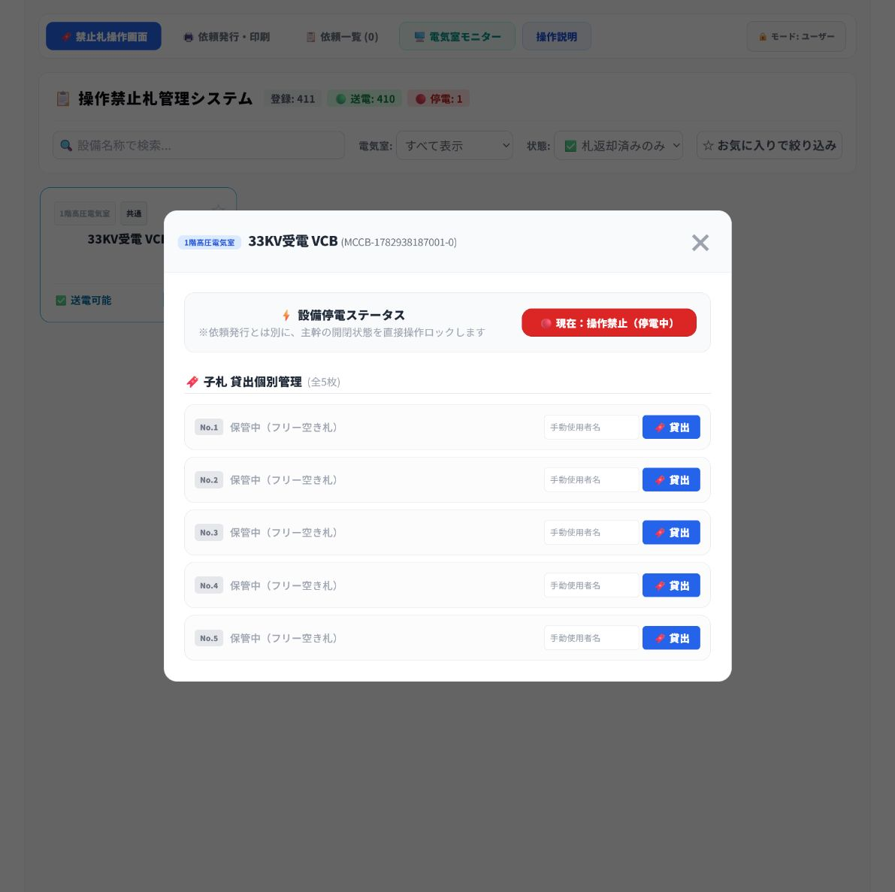
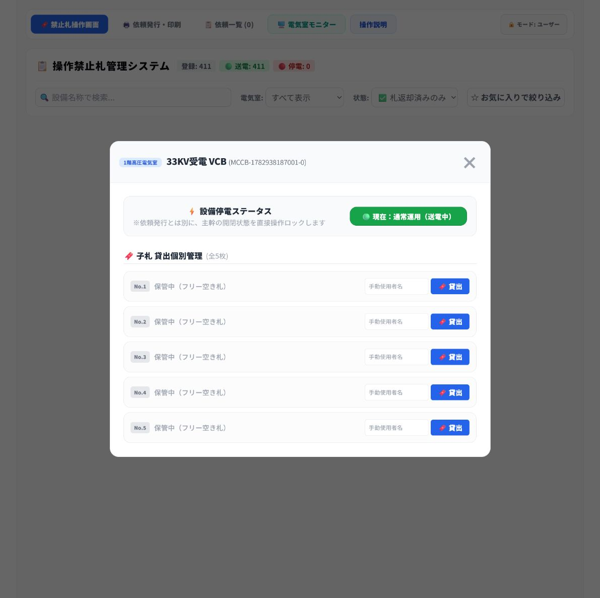

# 送電・依頼解約 手順書（一般作業者向け）

対象画面: `http://192.168.40.59:5000/#/`

> この手順書は、停電作業が完了した後に、依頼表と子札を受け取り、依頼を解約して対象設備を送電状態へ戻すまでの通常手順です。

## 1. 送電手順の全体像

1. 作業者から、印刷した依頼表と返却された子札を受け取ります。
2. 依頼一覧で該当の依頼を探し、依頼表の内容を確認します。
3. 対象設備一覧と子札の名称・番号が一致することを確認します。
4. 一致していれば、依頼を解約・作業完了にします。
5. 札操作画面で、状態を **札返却済みのみ** に切り替えます。
6. 対象設備が **送電可能** であることを確認し、実際の禁止札掛けに子札5枚がそろっていることを確認します。
7. 現地の安全手順に従って、実際の設備を送電します。
8. 操作画面で対象設備を送電状態に切り替え、表示が **通常運用（送電中）** に変わったことを確認します。

## 2. 依頼表と子札を受け取る

1. 作業者から、印刷済みの依頼表と子札を受け取ります。
2. 依頼表に記載された作業責任者名、作業内容、対象設備を確認します。
3. 子札に記載された設備名称と子札番号を確認します。

**確認ポイント**

- 依頼表、返却された子札、画面上の設備名称がすべて一致していることを確認します。
- 子札が不足している、または名称・番号が一致しない場合は、解約や送電を行わず責任者へ確認します。

## 3. 依頼一覧で該当依頼を確認する

1. 上部メニューの **依頼一覧** を選択します。
2. **進行中** の依頼から、依頼表の作業責任者名・作業内容・設備名が一致する依頼を探します。
3. **停電対象設備一覧** を展開します。
4. 表示された電気室名、設備名、貸出中の子札番号を、依頼表と子札に照合します。

**確認ポイント**

- 例では、対象設備は **33KV受電 VCB**、子札は **33KV受電 VCB No.1** です。
- 画面の貸出中子札と手元の子札が一致していることを確認します。

## 4. 依頼を解約・作業完了にする

1. 依頼表、対象設備、子札がすべて一致していることをもう一度確認します。
2. 依頼一覧の **解約・作業完了（札解放）** を押します。
3. 進行中の依頼一覧から当該依頼がなくなったことを確認します。

**注意**

- 一致確認前に解約しないでください。
- 解約・作業完了は子札を返却済みの状態にするため、未返却の子札がある場合は先に確認します。

## 5. 札返却済みの設備を絞り込む

1. 上部メニューの **禁止札操作画面** を選択します。
2. 画面中央の **状態** プルダウンで **✅ 札返却済みのみ** を選択します。
3. **✅ 送電可能** と表示された対象設備だけが表示されることを確認します。
4. 表示された設備名が、依頼表に記載された設備名と一致することを確認します。
5. 画面上で子札が **0枚** と表示され、送電可能であることを確認します。

## 6. 送電操作をする

1. 実際の禁止札掛けに、対象設備の子札を含む子札 **5枚すべて** がそろっていることを確認します。
2. 現地の送電条件と安全手順を確認し、実際の設備を送電します。
3. 送電後、**✅ 送電可能** と表示された対象設備カードを選択します。
4. 設備名、子札が **0枚** であること、状態が **現在：操作禁止（停電中）** であることを確認します。
5. 赤い **現在：操作禁止（停電中）** ボタンを押して、操作画面の状態を送電中へ切り替えます。

**注意**

- 実際の設備を送電した後に、操作画面の送電操作を実施してください。
- 画面上で「送電可能」かつ子札0枚であり、実際の禁止札掛けに子札5枚がそろっている場合だけ、送電操作を行います。

## 7. 送電完了を確認する

1. 表示が **現在：通常運用（送電中）** に変わったことを確認します。
2. 画面上部の集計で、停電台数が減り、送電台数が増えたことを確認します。
3. 必要に応じて、依頼表を所定の場所へ返却・保管します。

## 8. 作業完了前のチェックリスト

| 確認項目 | チェック |
| --- | --- |
| 依頼表と対象設備名が一致している | □ |
| 依頼表と子札の名称・番号が一致している | □ |
| 依頼を解約・作業完了にした | □ |
| 状態を「札返却済みのみ」に切り替えた | □ |
| 対象設備が「送電可能」、子札が0枚であることを確認した | □ |
| 実際の禁止札掛けに子札5枚がそろっていることを確認した | □ |
| 現地の送電条件と安全手順を確認した | □ |
| 現地の実設備を送電した | □ |
| 表示が「通常運用（送電中）」になったことを確認した | □ |
