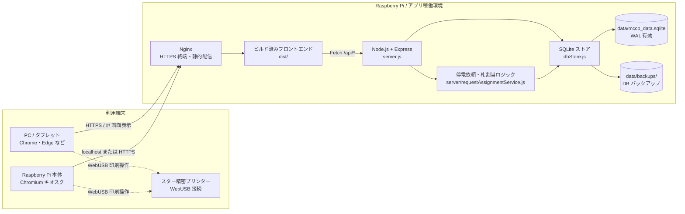
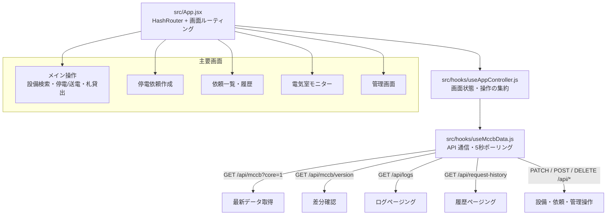
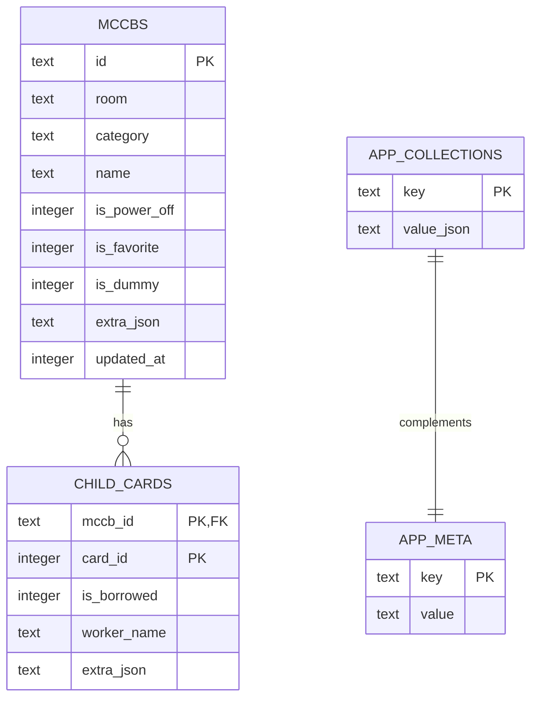
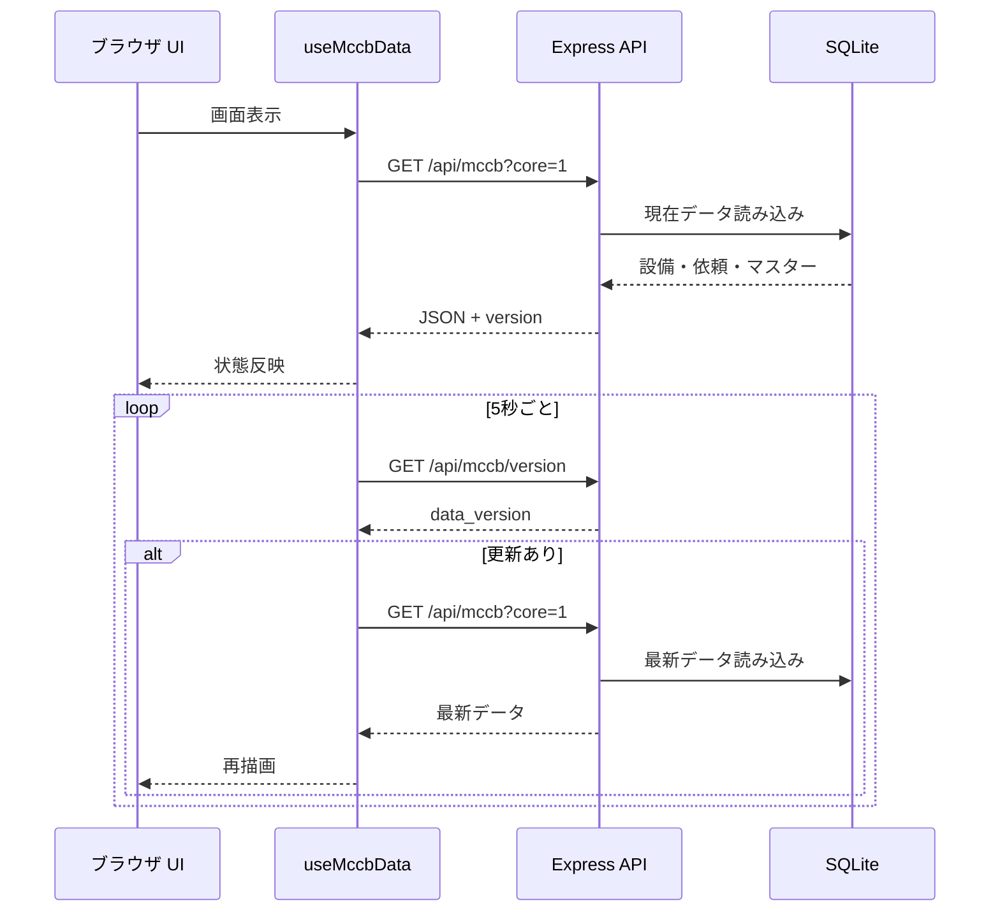
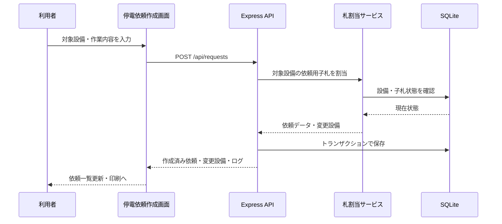

# システム構成図

MCCB Manager は、React/Vite のフロントエンド、Express の API サーバー、Node.js 組み込み SQLite による永続化で構成される単一拠点向け Web アプリです。Raspberry Pi 上で常時稼働させ、LAN 内の PC・タブレット・Pi 本体のキオスク表示から同じ画面を利用します。

## 全体構成

## アプリケーション構成

## データ構成

SQLite では、設備本体を `mccbs`、子札を `child_cards` に分離して保持します。部屋マスター、区分マスター、ログ、停電依頼、設備グループ、履歴設定などのアプリ横断データは `app_collections` に JSON として保持し、`app_meta` の `data_version` でクライアント同期用の更新バージョンを管理します。

## 主要な通信・処理フロー

### 通常同期

### 停電依頼発行

## デプロイ・運用上のポイント

- 本番運用では Raspberry Pi 上で Node.js/Express を起動し、Nginx から静的ファイルと API を提供します。
- クライアント側のルーティングは `HashRouter` なので、各画面は `/#/request` や `/#/admin` のような URL で開きます。
- WebUSB 印刷を使う端末は、Chrome/Edge で `localhost` または HTTPS の安全なコンテキストから開く必要があります。
- SQLite は WAL モードで動作し、定期チェックポイントとバックアップ作成に対応します。
- 管理画面から CSV 取込・マスター編集・ログ管理・履歴管理・DB バックアップ作成を実行できます。
