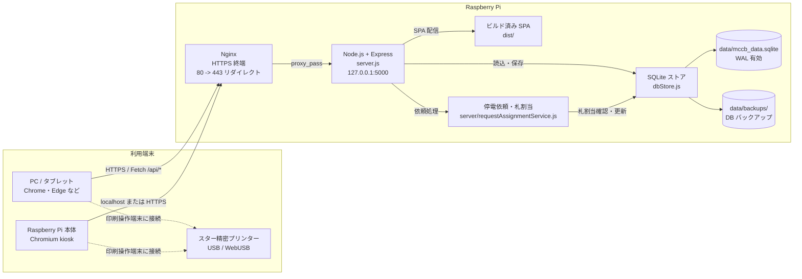
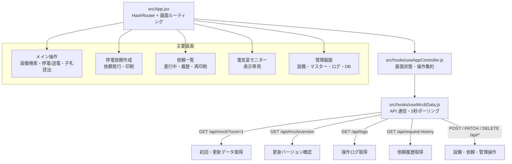
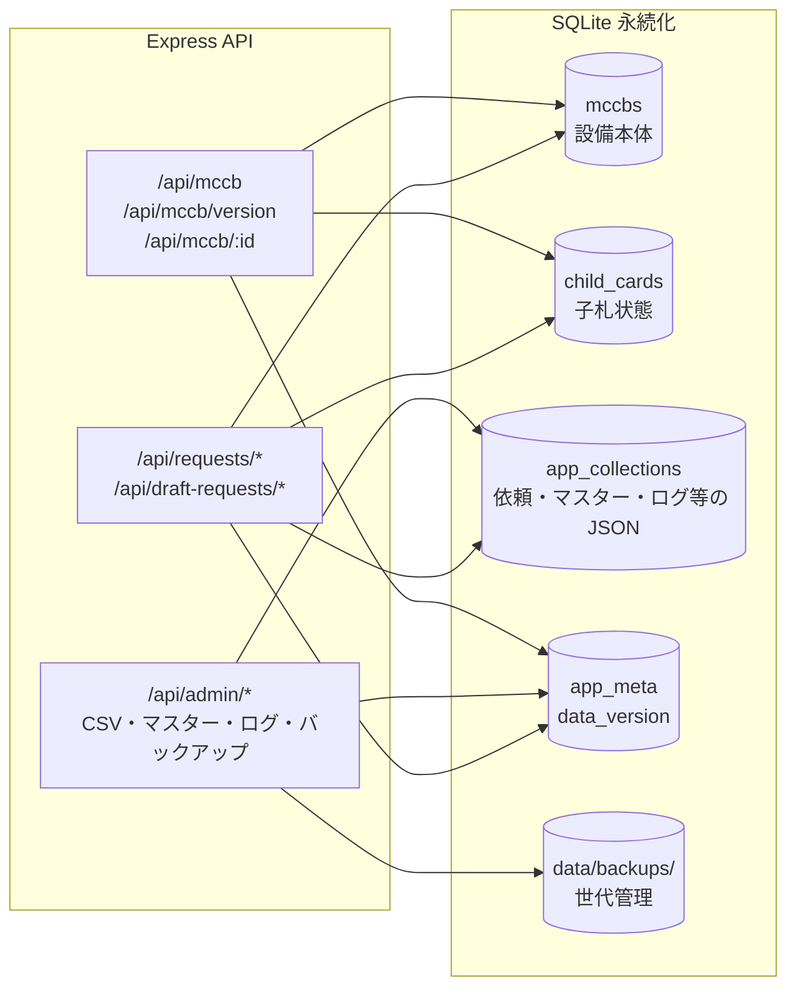
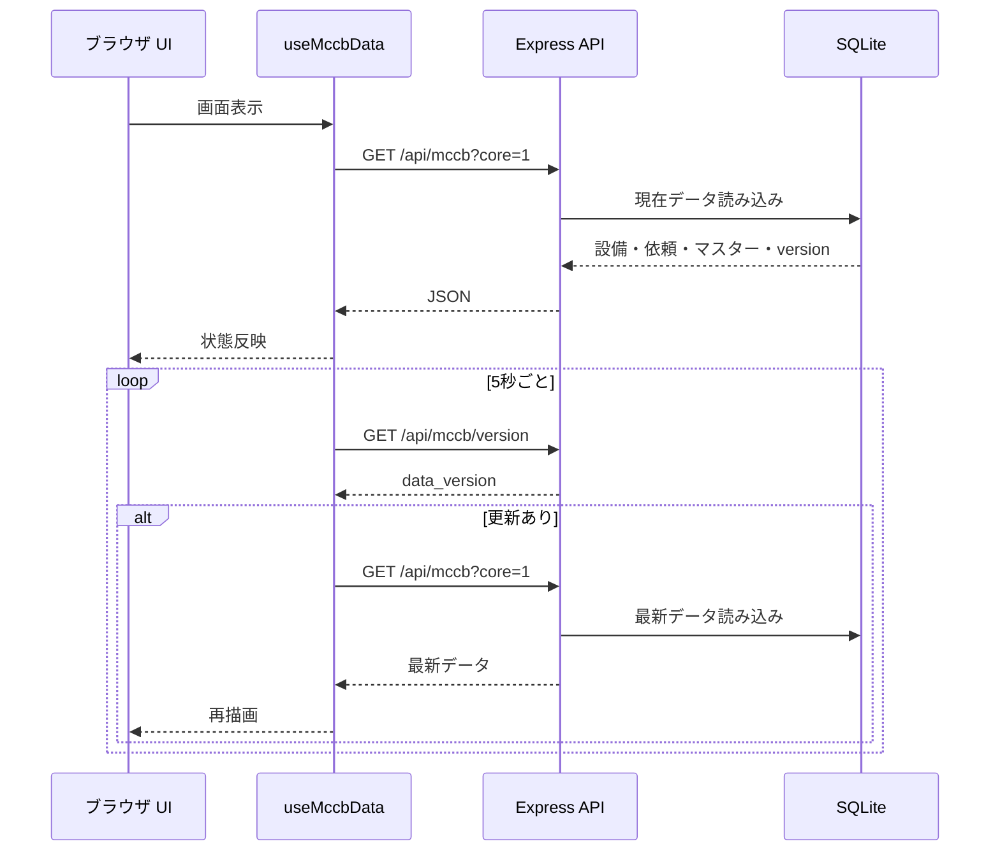
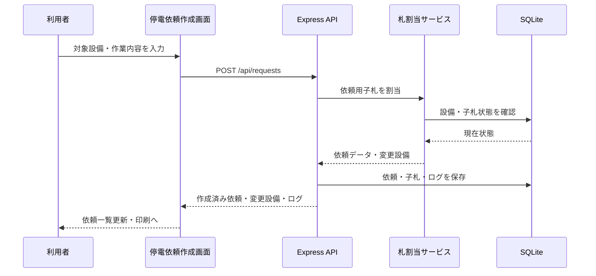
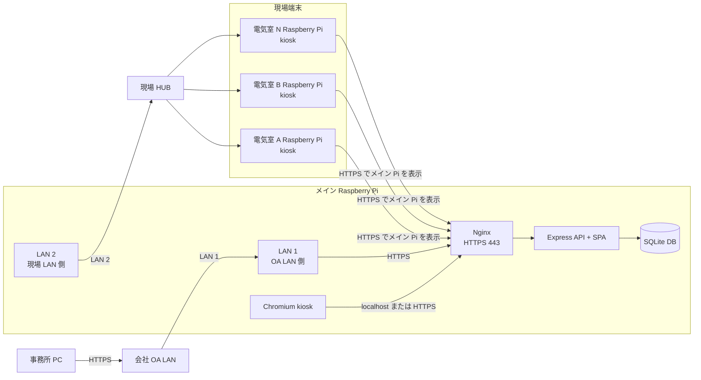

# システム構成図

MCCB Manager は、Raspberry Pi 上で常時稼働する単一拠点向け Web アプリです。React/Vite の画面、Express API、Node.js 組み込み SQLite による永続化を 1 台に集約し、Pi 本体の kiosk、PC、タブレットから同じ画面を利用します。

## 標準システム構成

## アプリケーション構成

## サーバー API と永続化

SQLite では、設備本体を `mccbs`、子札を `child_cards` に分離して保持します。部屋マスター、区分マスター、色設定、操作ログ、停電依頼、下書き依頼、依頼履歴、設備グループなどの横断データは `app_collections` に JSON として保存します。`app_meta` の `data_version` はクライアントの差分確認に使います。

## 通常同期フロー

## 停電依頼発行フロー

## OA LAN 拡張構成

会社 OA LAN から事務所 PC で操作し、現場側 Raspberry Pi はメイン Raspberry Pi の画面を kiosk 表示する構成です。メイン Raspberry Pi は OA LAN と現場 LAN の両方に接続しますが、ルーター、NAT、ブリッジとしては使いません。両 LAN から公開する入口は MCCB Manager の HTTPS のみに限定します。

この構成では、データベースをメイン Raspberry Pi に集約し、事務所 PC と各電気室端末は同じ Web アプリへ接続します。メイン Raspberry Pi が単一障害点になるため、DB バックアップ、予備 microSD、予備 Raspberry Pi、UPS、復旧手順を事前に用意します。

### OA LAN 接続時のセキュリティ方針

- OA LAN 側と現場 LAN 側は別セグメントにし、L2 ブリッジ、NAT、IP フォワーディングを無効にします。
- OA LAN から現場 Raspberry Pi や現場機器へ直接到達できない構成にします。
- 現場 LAN から OA LAN 上の PC、ファイルサーバー、インターネットへ直接到達できない構成にします。
- メイン Raspberry Pi の Nginx だけを両 LAN に公開し、公開ポートは原則 `443/tcp` に限定します。
- Express API は `127.0.0.1:5000` のみで待ち受け、LAN 側へ直接公開しません。
- SSH は保守用に必要な接続元だけ許可し、OA LAN 側または保守端末の固定 IP に制限します。
- 管理者モードは初期パスワードを必ず変更し、操作ログと DB バックアップを定期確認します。
- 証明書は自己署名の個別配布より、可能なら社内 CA または端末管理で信頼配布します。
- OS、Node.js、Nginx の更新手順を決め、更新前に DB バックアップを取得します。

## 運用上のポイント

- 本番運用では Raspberry Pi 上で Node.js/Express を起動し、Nginx は HTTPS 終端と `127.0.0.1:5000` へのリバースプロキシを担当します。
- Express は `/api/*` とビルド済みフロントエンド `dist/` の SPA 配信を担当します。
- クライアント側のルーティングは `HashRouter` なので、各画面は `/#/request` や `/#/admin` のような URL で開きます。
- WebUSB 印刷を使う端末は、Chrome/Edge で `localhost` または HTTPS の安全なコンテキストから開く必要があります。
- SQLite は WAL モードで動作し、定期チェックポイントとバックアップ作成に対応します。
- 管理画面から CSV 取込・マスター編集・ログ管理・履歴管理・DB バックアップ作成を実行できます。
